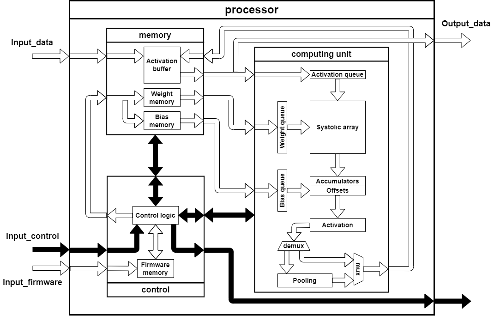
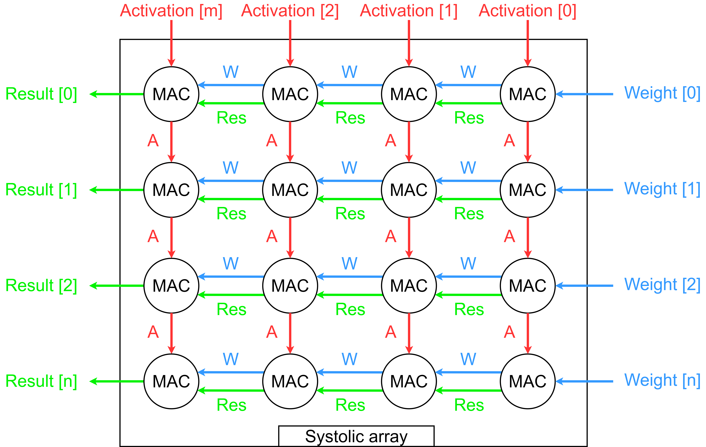
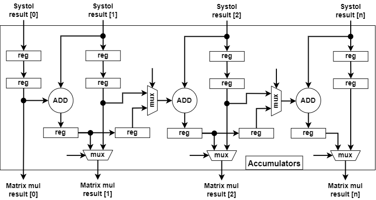
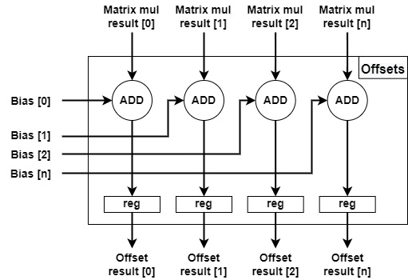
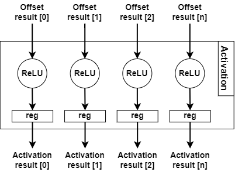
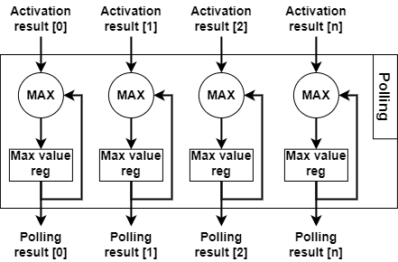

# NeuroProc_prototype

Prototype of Tensor neural processor for CNN processing acceleration

## Description

### Proposed neural processor architecture.

### Proposed microarchitecture of neural processor computing unit sub-blocks:

- __Systolic array microarchitecture__

- __MAC sub-block microarchitecture__

- __Accumulators sub-block microarchitecture__

- __Offsets sub-block microarchitecture__

- __Activation sub-block microarchitecture__

- __Polling sub-block microarchitecture__

## Repo structure

`/doc` - documentation files for used libraries and useful information files

`/src` - source files of neural processor modules

`/tb` - testbench files for testing neural processor modules in a simulation environment

`/xc7a100tcsg324_project` - Xilinx Vivado project for xc7a100tcsg324 FPGA

`/xc7a100tcsg324_project/waveform_cfg` - Xilinx Vivado waveform configuration files for all testbenches

## Simulation instruction

Xilinx Vivado CAD verison required: v2019.1 (64-bit)

1. Download and install Xilinx Vivado CAD
2. Open Vivado project `/xc7a100tcsg324_project/xc7a100tcsg324_project.xpr`
3. Select necessary testbench file and "Set as top"
4. Start "Behavioral Simulation"
5. The test results are displayed in the TCL console

## Publications

- Sergei Tabunschik, Sergei Bykovskii, Alexander Antonov, Alexander Belozubov, Pavel Kustarev, and Andrei Zhdanov "Neural processor architecture design for CNN processing acceleration", Proc. SPIE 12767, Optoelectronic Imaging and Multimedia Technology X, 127671G (27 November 2023). URL: https://doi.org/10.1117/12.2687678
